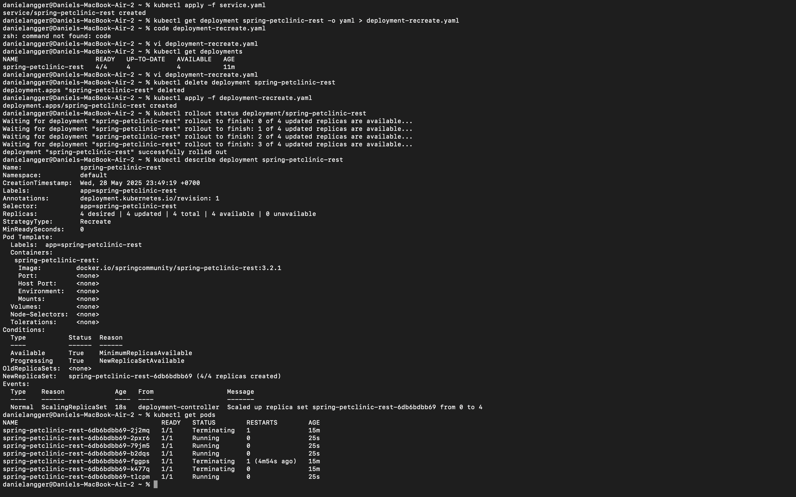

# Refleksi Tutorial 11 Adpro

## Reflection on Hello Minikube

### 1. Compare the application logs before and after you exposed it as a Service. Try to open the app several times while the proxy into the Service is running. What do you see in the logs? Does the number of logs increase each time you open the app?

Sebelum di-expose sebagai Service, log hanya menunjukkan pesan saat aplikasi pertama kali mulai, yaitu sebagai berikut:

I0528 15:49:34.192028       1 log.go:195] Started HTTP server on port 8080  
I0528 15:49:34.192398       1 log.go:195] Started UDP server on port  8081

Tetapi setelah di-expose sebagai Service, ada log baru yang muncul, yaitu sebagai berikut:

I0528 15:54:41.943357       1 log.go:195] GET /  
I0528 15:54:42.298240       1 log.go:195] GET /

Artinya, aplikasi telah menerima dua request HTTP GET ke path / , ini karena saya membuka aplikasi dua kali melalui browser saat proxy aktif.

### 2. Notice that there are two versions of `kubectl get` invocation during this tutorial section. The first does not have any option, while the latter has `-n` option with value set to `kube-system`. What is the purpose of the `-n` option and why did the output not list the pods/services that you explicitly created?

Opsi -n NAMA_NAMESPACE biasanya digunakan untuk menspesifikkan namespace dalam Kubernetes saat menjalankan perintah seperti kubectl get atau yang lainnya, sementara namespace adalah cara untuk mengorganisasi objek (Pod, Service, Deployment, dll) ke dalam lingkungan virtual yang terpisah di dalam kluster Kubernetes yang sama. Jika kita membuat Pod atau Service tanpa menyebutkan namespace, maka Kubernetes akan membuatnya di namespace default. Namun ketika kita menggunakan -n, maka kita hanya akan melihat Pod-Pod yang dibuat di dalam namespace yang kita ketik, yaitu milik sistem Kubernetes sendiri, bukan milik aplikasi yang kita buat.

## Reflection on Rolling Update & Kubernetes Manifest File

### 1. What is the difference between Rolling Update and Recreate deployment strategy?

Perbedaan dari Rolling Update dan Recreate adalah strategi RollingUpdate memperbarui Pod secara bertahap, sehingga aplikasi tetap dapat melayani permintaan tanpa downtime. Sementara itu, strategi Recreate menghancurkan semua Pod lama sebelum membuat yang baru, menyebabkan aplikasi sementara tidak tersedia. RollingUpdate cocok untuk lingkungan produksi karena mendukung zero downtime, sedangkan Recreate lebih sederhana dan digunakan terutama untuk pengembangan atau saat diperlukan restart total.

### 2. Try deploying the Spring Petclinic REST using Recreate deployment strategy and document your attempt.

### 3. Prepare different manifest files for executing Recreate deployment strategy.

Menggunakan dokumentasi yang sama, menggunakan file deployment-recreate.yaml.

### 4. What do you think are the benefits of using Kubernetes manifest files? Recall your experience in deploying the app manually and compare it to your experience when deploying the same app by applying the manifest files (i.e., invoking `kubectl apply -f` command) to the cluster.

Kubernetes manifest files dapat memberikan banyak keuntungan dalam proses deployment aplikasi. Dengan menggunakan file YAML, kita dapat mendefinisikan konfigurasi lengkap aplikasi secara jelas dan terstruktur, sehingga memudahkan pengelolaan, dokumentasi, dan reproduksi di berbagai lingkungan seperti development, staging, dan produksi. Berbeda dengan deploy manual yang membutuhkan banyak perintah satu per satu dan rentan terhadap kesalahan, penggunaan kubectl apply -f memungkinkan kita untuk mendeploy seluruh konfigurasi hanya dengan satu perintah, menjadikannya lebih cepat, aman, dan konsisten. Selain itu, manifest files juga bisa disimpan di sistem kontrol versi seperti Git, mempermudah pelacakan perubahan, kolaborasi tim, dan integrasi dengan pipeline CI/CD. Secara keseluruhan, penggunaan manifest files membuat proses deployment lebih efisien, transparan, dan mudah diotomatisasi.